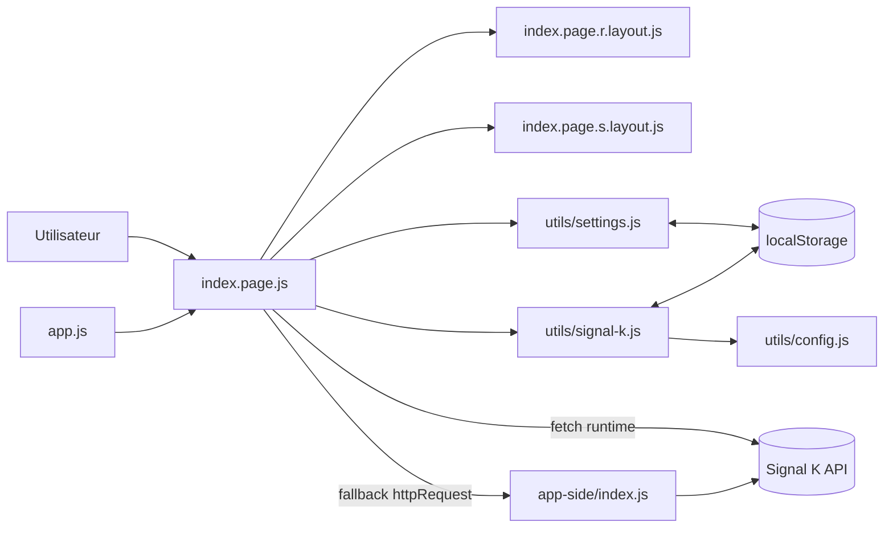
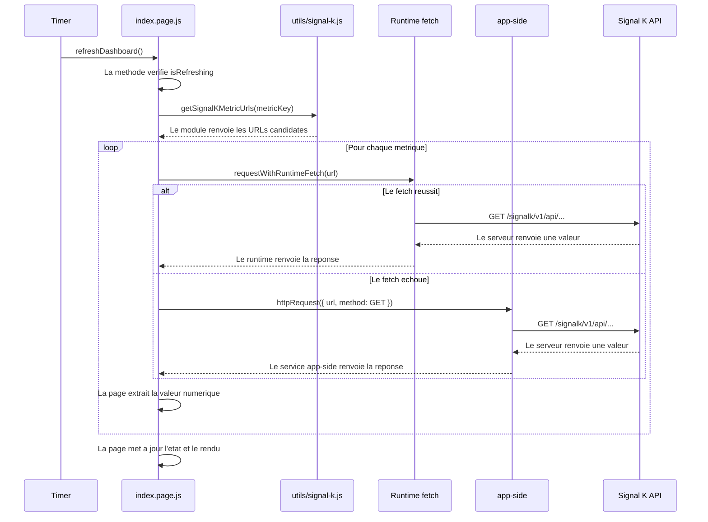
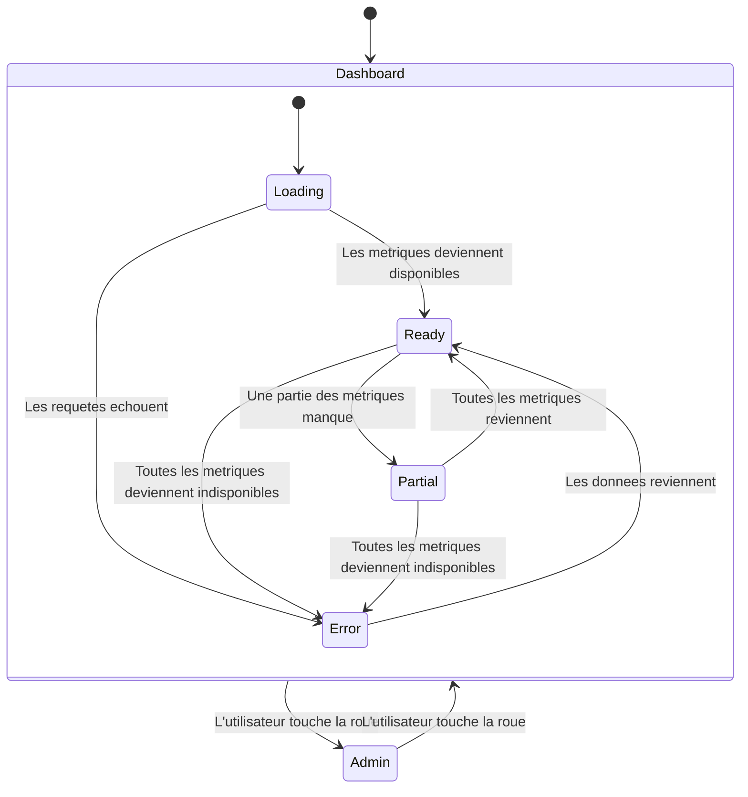

# Documentation de l'application et de l'architecture

## 1. Contexte

L'application `Boat Dashboard` tourne sur Zepp OS et elle affiche des donnees de navigation provenant d'un serveur Signal K.
L'application cible un usage en mer et elle privilegie la lisibilite ainsi qu'un rafraichissement regulier des mesures.
L'utilisateur peut modifier l'URL Signal K et la frequence de polling directement depuis la montre.

## 2. Fonctionnalites principales

L'application propose trois ecrans de donnees et chaque ecran regroupe des metriques coherentes.

- L'ecran `Vitesse bateau` affiche les valeurs `SOW` et `SOG`.
- L'ecran `Vent reel` affiche les valeurs `TWD`, `TWA` et `TWS`.
- L'ecran `Vent apparent` affiche les valeurs `AWD`, `AWA` et `AWS`.

L'utilisateur change d'ecran avec un geste gauche ou un geste droite.
L'utilisateur ouvre le panneau `Admin` avec le bouton roue et il ferme ce panneau avec le meme bouton.
Le panneau `Admin` permet de choisir la frequence de rafraichissement et de modifier l'URL du serveur Signal K.

## 3. Organisation du projet

Le projet suit l'organisation classique d'une application Zepp et chaque dossier a un role precis.

```text
zepp-application/
├── app.js                               # Entree application
├── app-side/index.js                    # Service app-side
├── app.json                             # Manifest Zepp
├── assets/
│   └── raw/modeles_meteo.json           # Donnees metier statiques embarquees
├── page/
│   ├── gt/home/index.page.js            # Logique UI et metier
│   ├── gt/home/index.page.r.layout.js   # Styles ecran rond
│   ├── gt/home/index.page.s.layout.js   # Styles ecran carre
│   └── i18n/{fr-FR.po,en-US.po}         # Traductions
└── utils/
    ├── config.js                        # Configuration initiale URL
    ├── signal-k.js                      # URLs metriques et normalisation
    ├── settings.js                      # Reglages frequence en localStorage
    └── weather-models.js                # Horaires modeles meteo (UTC -> local)
```

## 4. Architecture de haut niveau

Le composant `page/gt/home/index.page.js` orchestre l'affichage, le polling, la transformation des donnees et la gestion des erreurs.
Le composant `utils/signal-k.js` construit les URLs metriques et il normalise l'URL de base Signal K.
Le composant `utils/settings.js` lit et ecrit la frequence de refresh dans `localStorage`.
Le composant `app-side/index.js` sert de transport de secours quand le `fetch` runtime echoue.



## 5. Cycle de vie applicatif

Le runtime Zepp appelle `onInit()` et la page initialise son etat interne.
La page charge la frequence de refresh, elle charge l'URL Signal K et elle prepare les objets de debug.
Le runtime appelle ensuite `build()` et la page cree tous les widgets visibles.
La page enregistre les gestes utilisateur, elle applique un rendu initial et elle lance le polling periodique.
Le runtime appelle `onDestroy()` quand la page se ferme et la page nettoie le timer ainsi que les references widgets.

## 6. Flux de donnees et polling

Le timer appelle `refreshDashboard()` a intervalle fixe selon la frequence choisie.
La methode `refreshDashboard()` bloque les executions concurrentes avec `isRefreshing`.
La methode `fetchDashboardData()` recupere les metriques de l'ecran courant en parallele avec `Promise.all`.
La methode `fetchSignalKMetric()` essaye plusieurs URLs candidates pour une meme metrique.
La methode `fetchSignalKMetric()` utilise d'abord `fetch` runtime puis elle bascule sur `httpRequest` app-side si necessaire.
La methode `extractNumericValue()` valide le statut HTTP et elle convertit la charge utile en nombre.



## 7. Etat d'affichage

L'application combine un mode d'ecran et un etat de donnees.
Le mode d'ecran prend la valeur `Dashboard` ou la valeur `Admin`.
L'etat de donnees prend la valeur `loading`, `ready`, `partial` ou `error`.



## 8. Transformation metier des valeurs

Le code convertit les vitesses de metre par seconde en noeuds avec la constante `KNOTS_PER_MPS`.
Le code convertit les angles de radians en degres pour les directions et pour les angles signes.
Le code normalise les directions dans l'intervalle `0..359` et il normalise les angles signes dans `-180..180`.
Le code affiche des placeholders lorsque les valeurs ne sont pas numeriques.

## 9. Configuration et persistance

Le module `utils/settings.js` enregistre la frequence dans la cle `refresh_frequency`.
Le module `utils/settings.js` valide toutes les valeurs et il applique une valeur par defaut en cas d'entree invalide.
Le module `utils/signal-k.js` enregistre l'URL dans la cle `signal_k_base_url`.
Le module `utils/signal-k.js` stocke une version de schema dans la cle `signal_k_base_url_version`.
Le module `utils/signal-k.js` migre automatiquement la valeur stockee vers la version `2`.
Le module `utils/signal-k.js` normalise les protocoles, il retire les suffixes inutiles et il retire les slashs finaux.

## 10. Mapping des metriques Signal K

Le mapping `SIGNAL_K_METRIC_PATHS` associe chaque metrique metier a une liste de chemins API ordonnes.
Le code essaye les chemins dans l'ordre et il retient la premiere reponse valide.
Cette strategie ameliore la compatibilite avec des installations Signal K heterogenes.

## 11. Internationalisation

Le dossier `page/i18n` contient les traductions francaises et anglaises.
La fonction `t()` appelle `getText()` et elle applique des fallbacks locaux quand la traduction manque.
La fonction `t()` retourne la cle brute si aucun fallback ne fournit de valeur.

## 12. Gestion du layout multi-formes

Le fichier `index.page.js` charge les constantes de style via `zosLoader:./index.page.[pf].layout.js`.
Le runtime choisit automatiquement le layout rond (`.r.layout.js`) ou carre (`.s.layout.js`).
Cette approche partage une logique metier unique et elle adapte uniquement les positions et tailles visuelles.

## 13. Permissions et execution

Le manifest `app.json` declare les permissions `data:os.device.info` et `device:os.local_storage`.
Le runtime utilise ces permissions pour lire les informations appareil et pour persister les preferences.
L'application execute les appels reseau via les API Zepp disponibles dans le contexte montre/app-side.

## 14. Limites actuelles et suites possibles

Le projet ne contient pas encore de tests automatises unitaires ou d'integration.
Le projet concentre toute la logique metier dans une seule page applicative.
Une prochaine iteration peut extraire une couche service dediee reseau pour simplifier la maintenance.
Une prochaine iteration peut ajouter des tests unitaires pour les conversions numeriques et la normalisation d'URL.
